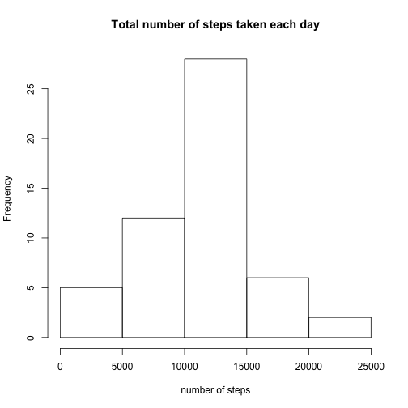
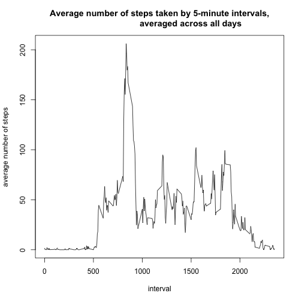
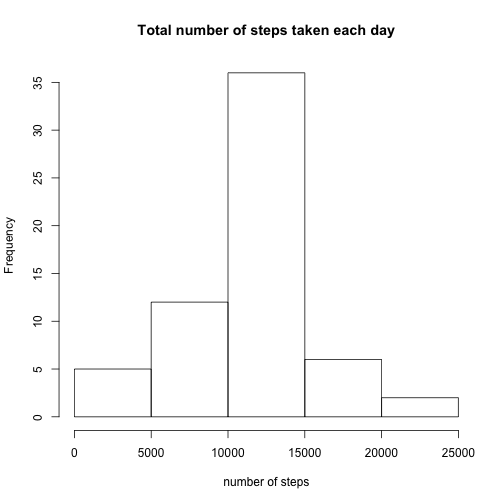
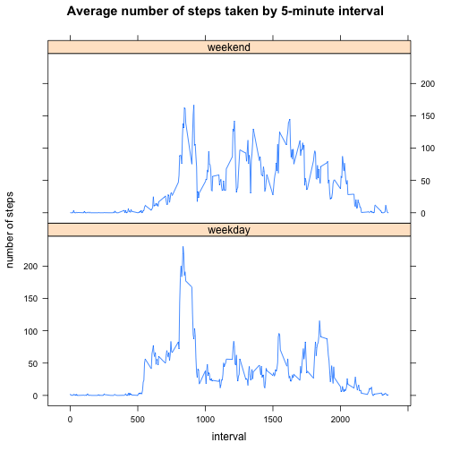

# Reproducible Research: Peer Assessment 1

## Loading and preprocessing the data


```r
temp <- tempfile()
file <- "http://d396qusza40orc.cloudfront.net/repdata%2Fdata%2Factivity.zip"
download.file(file, temp); fileDate <- date()
data <- read.csv(unz(temp, "activity.csv")); unlink(temp)
str(data)
```

```
## 'data.frame':	17568 obs. of  3 variables:
##  $ steps   : int  NA NA NA NA NA NA NA NA NA NA ...
##  $ date    : Factor w/ 61 levels "2012-10-01","2012-10-02",..: 1 1 1 1 1 1 1 1 1 1 ...
##  $ interval: int  0 5 10 15 20 25 30 35 40 45 ...
```
   
   
## What is mean total number of steps taken per day?

**Make a histogram of the total number of steps taken each day**

```r
library(plyr)
stepsDay <- ddply(data,.(date),summarize,sum=sum(steps))
hist(stepsDay$sum, main="Total number of steps taken each day", 
                   xlab="number of steps")
```

 

**Calculate and report the mean and median total number of steps taken per day**


```r
# Mean of the total number of steps taken per day
library(plyr)
ddply(data,.(date),summarize,mean=mean(steps))
```

```
##          date    mean
## 1  2012-10-01      NA
## 2  2012-10-02  0.4375
## 3  2012-10-03 39.4167
## 4  2012-10-04 42.0694
## 5  2012-10-05 46.1597
## 6  2012-10-06 53.5417
## 7  2012-10-07 38.2465
## 8  2012-10-08      NA
## 9  2012-10-09 44.4826
## 10 2012-10-10 34.3750
## 11 2012-10-11 35.7778
## 12 2012-10-12 60.3542
## 13 2012-10-13 43.1458
## 14 2012-10-14 52.4236
## 15 2012-10-15 35.2049
## 16 2012-10-16 52.3750
## 17 2012-10-17 46.7083
## 18 2012-10-18 34.9167
## 19 2012-10-19 41.0729
## 20 2012-10-20 36.0938
## 21 2012-10-21 30.6285
## 22 2012-10-22 46.7361
## 23 2012-10-23 30.9653
## 24 2012-10-24 29.0104
## 25 2012-10-25  8.6528
## 26 2012-10-26 23.5347
## 27 2012-10-27 35.1354
## 28 2012-10-28 39.7847
## 29 2012-10-29 17.4236
## 30 2012-10-30 34.0938
## 31 2012-10-31 53.5208
## 32 2012-11-01      NA
## 33 2012-11-02 36.8056
## 34 2012-11-03 36.7049
## 35 2012-11-04      NA
## 36 2012-11-05 36.2465
## 37 2012-11-06 28.9375
## 38 2012-11-07 44.7326
## 39 2012-11-08 11.1771
## 40 2012-11-09      NA
## 41 2012-11-10      NA
## 42 2012-11-11 43.7778
## 43 2012-11-12 37.3785
## 44 2012-11-13 25.4722
## 45 2012-11-14      NA
## 46 2012-11-15  0.1424
## 47 2012-11-16 18.8924
## 48 2012-11-17 49.7882
## 49 2012-11-18 52.4653
## 50 2012-11-19 30.6979
## 51 2012-11-20 15.5278
## 52 2012-11-21 44.3993
## 53 2012-11-22 70.9271
## 54 2012-11-23 73.5903
## 55 2012-11-24 50.2708
## 56 2012-11-25 41.0903
## 57 2012-11-26 38.7569
## 58 2012-11-27 47.3819
## 59 2012-11-28 35.3576
## 60 2012-11-29 24.4688
## 61 2012-11-30      NA
```

```r
# Median of the total number of steps taken per day
library(plyr)
ddply(data,.(date),summarize,median=median(steps))
```

```
##          date median
## 1  2012-10-01     NA
## 2  2012-10-02      0
## 3  2012-10-03      0
## 4  2012-10-04      0
## 5  2012-10-05      0
## 6  2012-10-06      0
## 7  2012-10-07      0
## 8  2012-10-08     NA
## 9  2012-10-09      0
## 10 2012-10-10      0
## 11 2012-10-11      0
## 12 2012-10-12      0
## 13 2012-10-13      0
## 14 2012-10-14      0
## 15 2012-10-15      0
## 16 2012-10-16      0
## 17 2012-10-17      0
## 18 2012-10-18      0
## 19 2012-10-19      0
## 20 2012-10-20      0
## 21 2012-10-21      0
## 22 2012-10-22      0
## 23 2012-10-23      0
## 24 2012-10-24      0
## 25 2012-10-25      0
## 26 2012-10-26      0
## 27 2012-10-27      0
## 28 2012-10-28      0
## 29 2012-10-29      0
## 30 2012-10-30      0
## 31 2012-10-31      0
## 32 2012-11-01     NA
## 33 2012-11-02      0
## 34 2012-11-03      0
## 35 2012-11-04     NA
## 36 2012-11-05      0
## 37 2012-11-06      0
## 38 2012-11-07      0
## 39 2012-11-08      0
## 40 2012-11-09     NA
## 41 2012-11-10     NA
## 42 2012-11-11      0
## 43 2012-11-12      0
## 44 2012-11-13      0
## 45 2012-11-14     NA
## 46 2012-11-15      0
## 47 2012-11-16      0
## 48 2012-11-17      0
## 49 2012-11-18      0
## 50 2012-11-19      0
## 51 2012-11-20      0
## 52 2012-11-21      0
## 53 2012-11-22      0
## 54 2012-11-23      0
## 55 2012-11-24      0
## 56 2012-11-25      0
## 57 2012-11-26      0
## 58 2012-11-27      0
## 59 2012-11-28      0
## 60 2012-11-29      0
## 61 2012-11-30     NA
```
   
   
## What is the average daily activity pattern?

**Make a time series plot (i.e. type = "l") of the 5-minute interval (x-axis) and the average number of steps taken, averaged across all days (y-axis)**


```r
library(plyr)
stepsInt <- ddply(data,.(interval),summarize,meanSteps=mean(steps, na.rm=TRUE))
with(stepsInt, plot(interval,meanSteps,
                    type="l", 
                    main="Average number of steps taken by 5-minute intervals,
                          averaged across all days",
                    ylab="average number of steps"))
```

 

**Which 5-minute interval, on average across all the days in the dataset, contains the maximum number of steps?**


```r
maxSteps <- stepsInt[which(stepsInt$mean==max(stepsInt$mean)),]
```

```
## Warning: Name partially matched in data frame
## Warning: Name partially matched in data frame
```

```r
(maxStepsInt <- maxSteps$interval)
```

```
## [1] 835
```

### The 5-minute interval, 835, contains the maximum number of steps.  
   
   
## Imputing missing values

**Calculate and report the total number of missing values in the dataset (i.e. the total number of rows with NAs)**


```r
missing <- data[is.na(data),]
rowsT <- nrow(data)
(rowsM <- nrow(missing))
```

```
## [1] 2304
```

### There are 2304 rows of 17568 rows containg missing values.
      
      
**Devise a strategy for filling in all of the missing values in the dataset.**
  
### The strategy used for filling the missing values is the mean for the 5-minute interval (rounded value), averaged across all days with no missing data.

**Create a new dataset that is equal to the original dataset but with the missing data filled in.**


```r
# Mean for 5-minute inteveral, averaged across all days with no missing data
library(plyr)
(stepsM <- ddply(data,.(interval),summarize,mean=round(mean(steps, na.rm=TRUE))))
```

```
##     interval mean
## 1          0    2
## 2          5    0
## 3         10    0
## 4         15    0
## 5         20    0
## 6         25    2
## 7         30    1
## 8         35    1
## 9         40    0
## 10        45    1
## 11        50    0
## 12        55    0
## 13       100    0
## 14       105    1
## 15       110    0
## 16       115    0
## 17       120    0
## 18       125    1
## 19       130    2
## 20       135    0
## 21       140    0
## 22       145    0
## 23       150    0
## 24       155    0
## 25       200    0
## 26       205    0
## 27       210    1
## 28       215    0
## 29       220    0
## 30       225    0
## 31       230    0
## 32       235    0
## 33       240    0
## 34       245    0
## 35       250    2
## 36       255    1
## 37       300    0
## 38       305    0
## 39       310    0
## 40       315    0
## 41       320    0
## 42       325    1
## 43       330    2
## 44       335    1
## 45       340    0
## 46       345    0
## 47       350    0
## 48       355    0
## 49       400    1
## 50       405    1
## 51       410    3
## 52       415    0
## 53       420    0
## 54       425    0
## 55       430    4
## 56       435    1
## 57       440    3
## 58       445    1
## 59       450    3
## 60       455    1
## 61       500    0
## 62       505    2
## 63       510    3
## 64       515    2
## 65       520    3
## 66       525    3
## 67       530    2
## 68       535    6
## 69       540   16
## 70       545   18
## 71       550   39
## 72       555   44
## 73       600   31
## 74       605   49
## 75       610   54
## 76       615   63
## 77       620   50
## 78       625   47
## 79       630   52
## 80       635   39
## 81       640   44
## 82       645   44
## 83       650   37
## 84       655   49
## 85       700   44
## 86       705   44
## 87       710   51
## 88       715   55
## 89       720   50
## 90       725   51
## 91       730   56
## 92       735   44
## 93       740   52
## 94       745   70
## 95       750   58
## 96       755   56
## 97       800   73
## 98       805   68
## 99       810  129
## 100      815  158
## 101      820  171
## 102      825  155
## 103      830  177
## 104      835  206
## 105      840  196
## 106      845  180
## 107      850  183
## 108      855  167
## 109      900  143
## 110      905  124
## 111      910  109
## 112      915  108
## 113      920  104
## 114      925   96
## 115      930   66
## 116      935   45
## 117      940   25
## 118      945   39
## 119      950   35
## 120      955   21
## 121     1000   41
## 122     1005   27
## 123     1010   42
## 124     1015   53
## 125     1020   39
## 126     1025   51
## 127     1030   44
## 128     1035   37
## 129     1040   35
## 130     1045   28
## 131     1050   25
## 132     1055   32
## 133     1100   31
## 134     1105   30
## 135     1110   21
## 136     1115   26
## 137     1120   28
## 138     1125   26
## 139     1130   33
## 140     1135   50
## 141     1140   42
## 142     1145   45
## 143     1150   46
## 144     1155   59
## 145     1200   64
## 146     1205   88
## 147     1210   95
## 148     1215   93
## 149     1220   63
## 150     1225   50
## 151     1230   54
## 152     1235   32
## 153     1240   27
## 154     1245   38
## 155     1250   45
## 156     1255   67
## 157     1300   42
## 158     1305   40
## 159     1310   43
## 160     1315   41
## 161     1320   46
## 162     1325   56
## 163     1330   43
## 164     1335   25
## 165     1340   40
## 166     1345   54
## 167     1350   47
## 168     1355   61
## 169     1400   56
## 170     1405   52
## 171     1410   44
## 172     1415   49
## 173     1420   35
## 174     1425   38
## 175     1430   42
## 176     1435   28
## 177     1440   17
## 178     1445   26
## 179     1450   44
## 180     1455   44
## 181     1500   30
## 182     1505   36
## 183     1510   35
## 184     1515   39
## 185     1520   46
## 186     1525   48
## 187     1530   48
## 188     1535   65
## 189     1540   83
## 190     1545   99
## 191     1550  102
## 192     1555   84
## 193     1600   62
## 194     1605   64
## 195     1610   75
## 196     1615   63
## 197     1620   57
## 198     1625   60
## 199     1630   44
## 200     1635   39
## 201     1640   45
## 202     1645   45
## 203     1650   46
## 204     1655   44
## 205     1700   47
## 206     1705   56
## 207     1710   51
## 208     1715   61
## 209     1720   73
## 210     1725   79
## 211     1730   69
## 212     1735   60
## 213     1740   75
## 214     1745   57
## 215     1750   35
## 216     1755   37
## 217     1800   41
## 218     1805   58
## 219     1810   75
## 220     1815   85
## 221     1820   59
## 222     1825   68
## 223     1830   78
## 224     1835   74
## 225     1840   85
## 226     1845   99
## 227     1850   87
## 228     1855   86
## 229     1900   85
## 230     1905   78
## 231     1910   58
## 232     1915   53
## 233     1920   36
## 234     1925   21
## 235     1930   27
## 236     1935   40
## 237     1940   30
## 238     1945   26
## 239     1950   46
## 240     1955   34
## 241     2000   20
## 242     2005   19
## 243     2010   19
## 244     2015   33
## 245     2020   27
## 246     2025   21
## 247     2030   27
## 248     2035   21
## 249     2040   20
## 250     2045   21
## 251     2050   32
## 252     2055   20
## 253     2100   16
## 254     2105   17
## 255     2110   23
## 256     2115   19
## 257     2120   12
## 258     2125    8
## 259     2130   15
## 260     2135   16
## 261     2140    9
## 262     2145    8
## 263     2150    8
## 264     2155    3
## 265     2200    1
## 266     2205    4
## 267     2210    5
## 268     2215    9
## 269     2220    7
## 270     2225    9
## 271     2230   10
## 272     2235    2
## 273     2240    0
## 274     2245    0
## 275     2250    2
## 276     2255    5
## 277     2300    3
## 278     2305    3
## 279     2310    0
## 280     2315    1
## 281     2320    1
## 282     2325    2
## 283     2330    3
## 284     2335    5
## 285     2340    3
## 286     2345    1
## 287     2350    0
## 288     2355    1
```

```r
# Create new dataset with missing data filled in
xMerge <- merge(data, stepsM, by="interval")
xMerge$steps <- ifelse(is.na(xMerge$steps), xMerge$mean,xMerge$steps)

newData <- xMerge[,c("steps","date","interval")]
newData <- newData[order(newData$date,newData$interval),]
```

***Make a histogram of the total number of steps taken each day***
***Calculate and report the mean and median total number of steps taken per day.*** 


```r
library(plyr)
stepsDayN <- ddply(newData,.(date),summarize,sum=sum(steps))

# Histogram of the total number of steps taken each day
hist(stepsDayN$sum, main="Total number of steps taken each day", 
                   xlab="number of steps")
```

 

```r
# Mean of the total number of steps taken per day
ddply(newData,.(date),summarize,median=mean(steps))
```

```
##          date  median
## 1  2012-10-01 37.3681
## 2  2012-10-02  0.4375
## 3  2012-10-03 39.4167
## 4  2012-10-04 42.0694
## 5  2012-10-05 46.1597
## 6  2012-10-06 53.5417
## 7  2012-10-07 38.2465
## 8  2012-10-08 37.3681
## 9  2012-10-09 44.4826
## 10 2012-10-10 34.3750
## 11 2012-10-11 35.7778
## 12 2012-10-12 60.3542
## 13 2012-10-13 43.1458
## 14 2012-10-14 52.4236
## 15 2012-10-15 35.2049
## 16 2012-10-16 52.3750
## 17 2012-10-17 46.7083
## 18 2012-10-18 34.9167
## 19 2012-10-19 41.0729
## 20 2012-10-20 36.0938
## 21 2012-10-21 30.6285
## 22 2012-10-22 46.7361
## 23 2012-10-23 30.9653
## 24 2012-10-24 29.0104
## 25 2012-10-25  8.6528
## 26 2012-10-26 23.5347
## 27 2012-10-27 35.1354
## 28 2012-10-28 39.7847
## 29 2012-10-29 17.4236
## 30 2012-10-30 34.0938
## 31 2012-10-31 53.5208
## 32 2012-11-01 37.3681
## 33 2012-11-02 36.8056
## 34 2012-11-03 36.7049
## 35 2012-11-04 37.3681
## 36 2012-11-05 36.2465
## 37 2012-11-06 28.9375
## 38 2012-11-07 44.7326
## 39 2012-11-08 11.1771
## 40 2012-11-09 37.3681
## 41 2012-11-10 37.3681
## 42 2012-11-11 43.7778
## 43 2012-11-12 37.3785
## 44 2012-11-13 25.4722
## 45 2012-11-14 37.3681
## 46 2012-11-15  0.1424
## 47 2012-11-16 18.8924
## 48 2012-11-17 49.7882
## 49 2012-11-18 52.4653
## 50 2012-11-19 30.6979
## 51 2012-11-20 15.5278
## 52 2012-11-21 44.3993
## 53 2012-11-22 70.9271
## 54 2012-11-23 73.5903
## 55 2012-11-24 50.2708
## 56 2012-11-25 41.0903
## 57 2012-11-26 38.7569
## 58 2012-11-27 47.3819
## 59 2012-11-28 35.3576
## 60 2012-11-29 24.4688
## 61 2012-11-30 37.3681
```

```r
# Median of the total number of steps taken per day
ddply(newData,.(date),summarize,median=median(steps))
```

```
##          date median
## 1  2012-10-01   34.5
## 2  2012-10-02    0.0
## 3  2012-10-03    0.0
## 4  2012-10-04    0.0
## 5  2012-10-05    0.0
## 6  2012-10-06    0.0
## 7  2012-10-07    0.0
## 8  2012-10-08   34.5
## 9  2012-10-09    0.0
## 10 2012-10-10    0.0
## 11 2012-10-11    0.0
## 12 2012-10-12    0.0
## 13 2012-10-13    0.0
## 14 2012-10-14    0.0
## 15 2012-10-15    0.0
## 16 2012-10-16    0.0
## 17 2012-10-17    0.0
## 18 2012-10-18    0.0
## 19 2012-10-19    0.0
## 20 2012-10-20    0.0
## 21 2012-10-21    0.0
## 22 2012-10-22    0.0
## 23 2012-10-23    0.0
## 24 2012-10-24    0.0
## 25 2012-10-25    0.0
## 26 2012-10-26    0.0
## 27 2012-10-27    0.0
## 28 2012-10-28    0.0
## 29 2012-10-29    0.0
## 30 2012-10-30    0.0
## 31 2012-10-31    0.0
## 32 2012-11-01   34.5
## 33 2012-11-02    0.0
## 34 2012-11-03    0.0
## 35 2012-11-04   34.5
## 36 2012-11-05    0.0
## 37 2012-11-06    0.0
## 38 2012-11-07    0.0
## 39 2012-11-08    0.0
## 40 2012-11-09   34.5
## 41 2012-11-10   34.5
## 42 2012-11-11    0.0
## 43 2012-11-12    0.0
## 44 2012-11-13    0.0
## 45 2012-11-14   34.5
## 46 2012-11-15    0.0
## 47 2012-11-16    0.0
## 48 2012-11-17    0.0
## 49 2012-11-18    0.0
## 50 2012-11-19    0.0
## 51 2012-11-20    0.0
## 52 2012-11-21    0.0
## 53 2012-11-22    0.0
## 54 2012-11-23    0.0
## 55 2012-11-24    0.0
## 56 2012-11-25    0.0
## 57 2012-11-26    0.0
## 58 2012-11-27    0.0
## 59 2012-11-28    0.0
## 60 2012-11-29    0.0
## 61 2012-11-30   34.5
```

*Do these values differ from the estimates from the first part of the assignment? What is the impact of imputing missing data on the estimates of the total daily number of step?*
   
All the dates with missing data in the original dataset have the same estimates for the total daily number of steps in the new dataset.
   
   
## Are there differences in activity patterns between weekdays and weekends?

***Create a new factor variable with two levels – “weekday” and “weekend” indicatig whether a given date is a weekday or weekend day.***


```r
newData$date <- as.Date(newData$date, "%Y-%m-%d")
newData$day <- weekdays(newData$date)
newData$type <- factor(ifelse(newData$day=='Saturday'|newData$day=='Sunday',
                "weekend","weekday"), labels=c("weekday","weekend"))
str(newData)
```

```
## 'data.frame':	17568 obs. of  5 variables:
##  $ steps   : num  2 0 0 0 0 2 1 1 0 1 ...
##  $ date    : Date, format: "2012-10-01" "2012-10-01" ...
##  $ interval: int  0 5 10 15 20 25 30 35 40 45 ...
##  $ day     : chr  "Monday" "Monday" "Monday" "Monday" ...
##  $ type    : Factor w/ 2 levels "weekday","weekend": 1 1 1 1 1 1 1 1 1 1 ...
```

***Make a panel plot containing a time series plot (i.e. type = "l") of the 5-minute interval (x-axis) and the average number of steps taken, averaged across all weekday days or weekend days (y-axis).***


```r
library(lattice)
stepsIntW <- ddply(newData,.(interval,type),summarize,meanSteps=mean(steps))
with(stepsIntW, xyplot(meanSteps ~ interval | type, 
                       type="l", 
                       main="Average number of steps taken by 5-minute interval",
                       ylab="number of steps",
                       layout = c(1, 2)))
```

 

